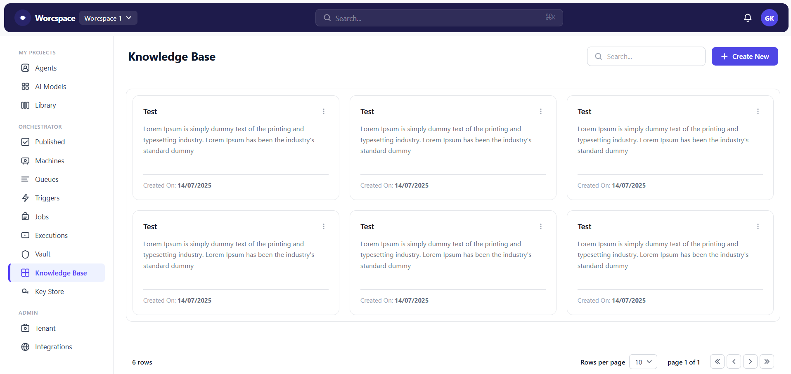
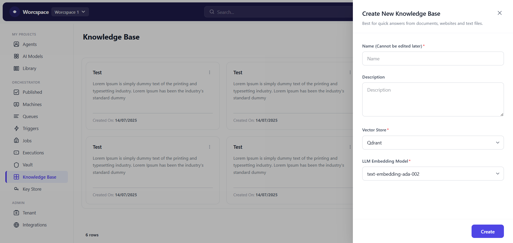

# Worcspace Knowledge Base UI

A responsive React front-end application replicating a Knowledge Base management screen, built with **React** and **Tailwind CSS v4**.

## Screenshots

### Screen 1 — Home Screen (Knowledge Base)


### Screen 2 — Create New Knowledge Base (Modal)


## Tech Stack

- **React 19** — functional components + hooks
- **Tailwind CSS v4** — via `@tailwindcss/vite` plugin
- **Vite 8** — dev server & bundler

## Project Structure

```
src/
├── components/
│   ├── Icons.jsx          # All SVG icon components
│   ├── Navbar.jsx         # Top navigation bar
│   ├── Sidebar.jsx        # Left sidebar with nav sections
│   ├── KnowledgeCard.jsx  # Individual knowledge base card
│   ├── CreateNewModal.jsx # Slide-in modal for creating a KB
│   └── Pagination.jsx     # Pagination footer
├── App.jsx                # Root component & state
├── main.jsx
└── index.css
```

## Getting Started

```bash
npm install
npm run dev
```

## Features

- Responsive layout (mobile sidebar drawer + desktop fixed sidebar)
- Search / filter knowledge base cards
- "Create New" slide-in panel with form validation
- Card context menu (Edit, Duplicate, Delete)
- Pagination footer with rows-per-page selector
